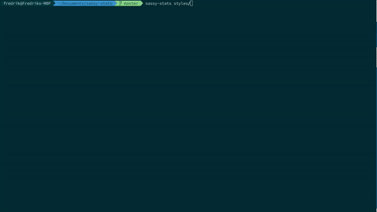

# Sassy-stats

CLI for figuring out what you are using in your Sass files.
The project goal is to provide an easy to use tool that will tell you what is going on in your .scss files.

## Install
`npm install -g sassy-stats`

## Usage
`sassy-stats <directory>`

Sassy-stats will spit out a list of how many references it found of:
* Colors
* Fonts
* Mixins
* Functions
* Variables
* Files
* Selectors

For additional command help run `sassy-stats -h`
